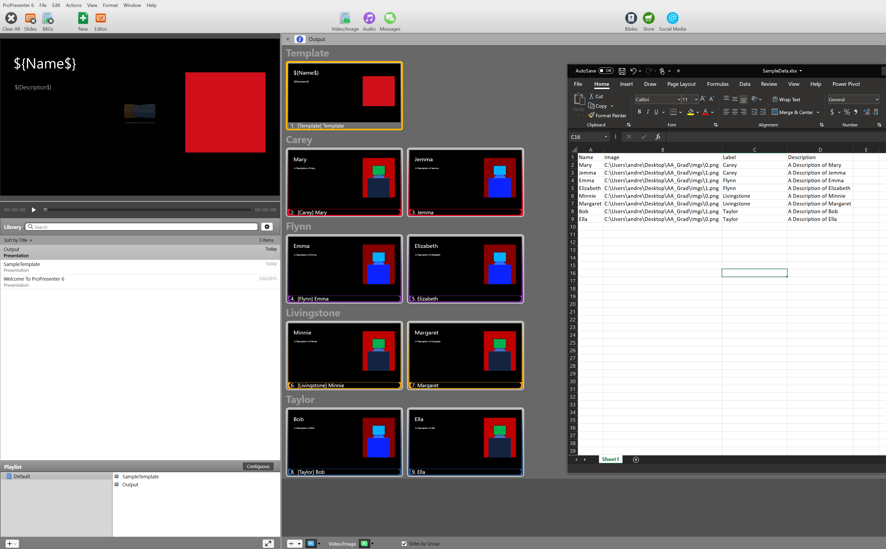

This is a (very specialised for my purpose) templating script that we use to create ProPresenter 6 slides as according to an Excel spreadsheet. Feel free to modify and use yourself at your own risk: there is no guarantee that it will work for your case, nor is any warranty of any kind offered. You will need to install *pandas*, *xlrd* and *lxml* from pip.

